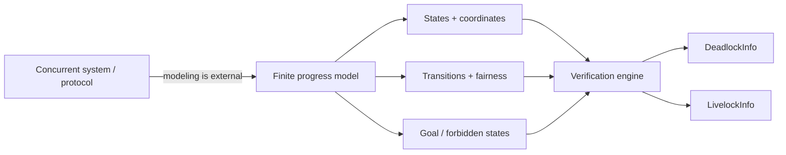

# Documentation

このディレクトリは、`ProgressBasedVerificationEngine` を「使う」「読む」「拡張する」ための技術資料です。

## Recommended reading order

1. [Modeling Guide](modeling-guide.md) — 何を状態・遷移として入力するか
2. [Architecture](architecture.md) — コード全体の責務とデータフロー
3. [Algorithms](algorithms.md) — deadlock / livelock 判定の内部原理
4. [API Reference](api-reference.md) — 公開型とメソッド
5. [Development Guide](development.md) — テスト、lint、型検査、build
6. [Limitations](limitations.md) — 現実装で誤解しやすい点と拡張候補

## Mental model

このライブラリは「並行プログラムそのもの」を解析するのではなく、ユーザーが構築した有限状態モデルを解析します。

重要なのは、検出結果の正しさが入力モデルの粒度・fairness の定義・2-cell の与え方に依存することです。
