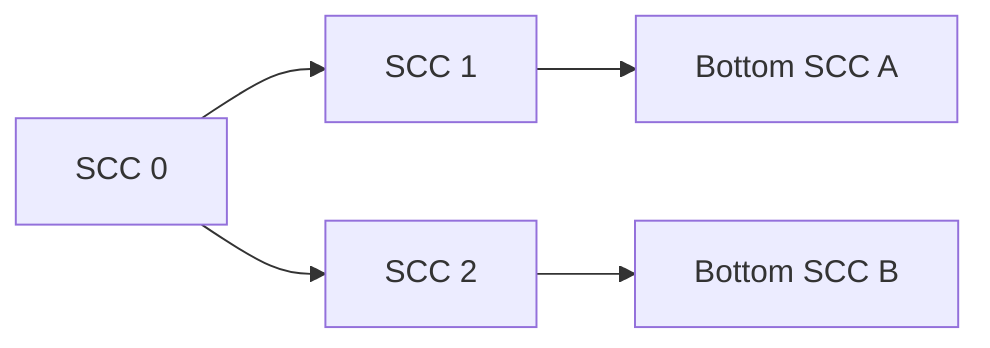

# Algorithms

## Deadlock detection

### Definition used by the implementation

実装上の deadlock は、単に「出辺がない state」ではありません。

1. valid graph を SCC に分解する
2. SCC condensation graph を作る
3. 出辺のない SCC を bottom SCC / terminal trap region とする
4. 各 state から到達可能な bottom SCC を集める
5. その終端領域のどこにも goal が存在しなければ、その state を deadlock として報告する

### Why SCC?

並行システムでは、停止せず内部状態を回り続ける trap もあります。

```text
A -> B -> C
     ^    |
     |____|
```

`B <-> C` が外へ出られなければ、単独の terminal state ではなく SCC 全体が trap region になります。

### Condensation graph

SCC を1ノードに潰すと DAG になります。



ある state が属する SCC から到達可能な bottom SCC を再帰的に計算し、結果を cache します。

### Result semantics

`DeadlockInfo`:

- `state`: deadlock 条件を満たす解析起点。terminal SCC 内に限らず、その trap にしか終端できない上流 state も含み得る
- `persistent_reachable`: その state から最終的に閉じ込められ得る bottom SCC の state の和集合
- `trap_regions`: bottom SCC ごとの state 集合

注意: 現実装では、到達可能な bottom SCC のうち1つでも goal を含む場合、その起点 state は deadlock として報告されません。つまり「goal なしの trap へ行く経路もある」という may-deadlock 判定ではなく、「終端候補全体が goal と disjoint」という条件です。

### Complexity

Tarjan SCC 自体は状態数 `V`、遷移数 `E` に対して `O(V + E)` です。

その後の condensation DAG と reachable-bottom 計算も cache を利用するため、グラフ部分は概ね線形規模で扱えます。

---

## Livelock detection

### Analysis space

最初に次を除外します。

- forbidden state
- goal state
- unfair edge

残った fair non-goal subcomplex を解析します。

### Chain complex

0-cell を state、1-cell を transition、2-cell を commuting square 等とみなします。

```text
C2 --D2--> C1 --D1--> C0
```

`D1` は edge の incidence matrix です。

ある edge `u -> v` の列には、

```text
u: -1
v: +1
```

が入ります。

### Cycle space

`D1 x = 0` を満たす 1-chain は境界を持たないため cycle です。

実装では NumPy SVD により `ker(D1)` の basis を求めます。

```python
_, singular_values, vh = np.linalg.svd(D1, full_matrices=True)
rank = (singular_values > tolerance).sum()
null_basis = vh[rank:].T
```

### Why D2 is needed

グラフだけを見ると四角形の外周も cycle です。

```text
A ----> B
^       |
|       v
D <---- C
```

しかし、その四角形が「内部を持つ 2-cell」であれば、その外周は `D2` の image に入り、1次ホモロジーでは自明になります。

そのため対象は単なる `ker(D1)` ではなく、

```text
H1 = ker(D1) / im(D2)
```

です。

### Implementation test for non-triviality

実装は `D2` の rank を計算し、nullspace basis の representative を1本ずつ追加した augmented matrix の rank が増えるか確認します。

```text
rank([D2 | representative]) > rank(D2)
```

増えるなら、その representative は `im(D2)` に含まれないと判断され、livelock 候補になります。

### Cycle extraction

非自明 representative の係数絶対値が `tolerance` より大きい edge を選び、その有向部分グラフに DFS を行って cycle を1本抽出します。

返り値 `LivelockInfo` には次が含まれます。

- `homology_dimension`
- `cycle_edges`
- `cycle_states`
- `representative`

### Two-cell construction

`two_cells` が指定されていればそれを利用します。

指定されていなければ、座標を各 axis について `+1` した unit square を探索し、4辺が valid transition として存在する場合に 2-cell を推論します。

### Numerical tolerance

デフォルトは `1e-9` です。

```python
engine.detect_livelocks(tolerance=1e-9)
```

SVD と matrix rank は floating-point 計算なので、非常に大きい・悪条件な行列では tolerance により判定が変わる可能性があります。

---

## Important distinction: deadlock vs livelock

| | Deadlock | Livelock |
|---|---|---|
| 主な構造 | terminal SCC | fair non-trivial 1-cycle |
| goal の扱い | terminal region に goal があるか | goal を解析空間から除外 |
| fairness | 使用しない | 使用する |
| coordinates | 単調性検証のみ | 単調性 + 2-cell 推論 |
| NumPy 線形代数 | 不要 | 必要 |

Deadlock と livelock は別のアルゴリズムであり、一方の結果から他方を推定してはいけません。
