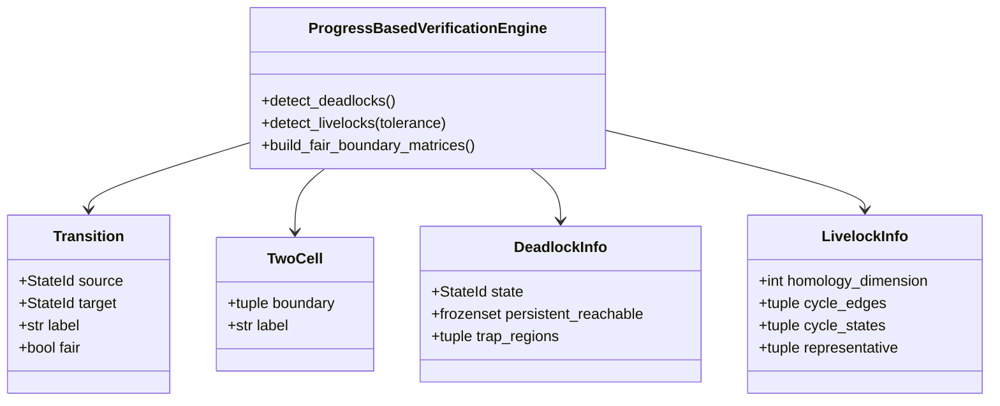
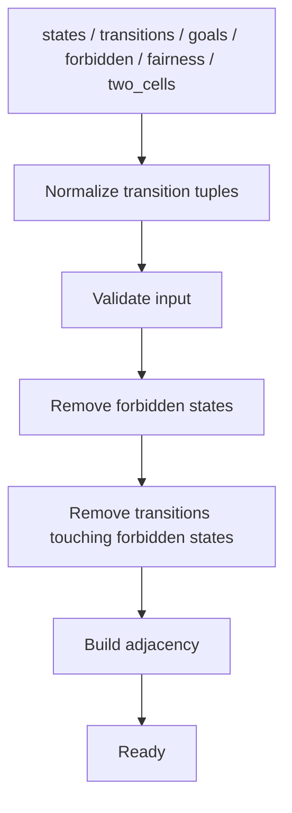
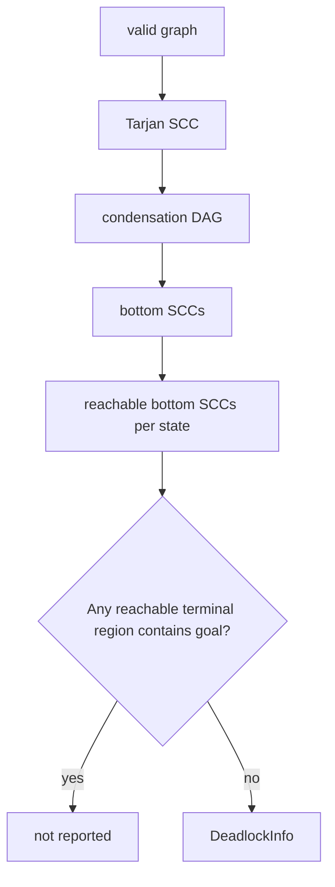
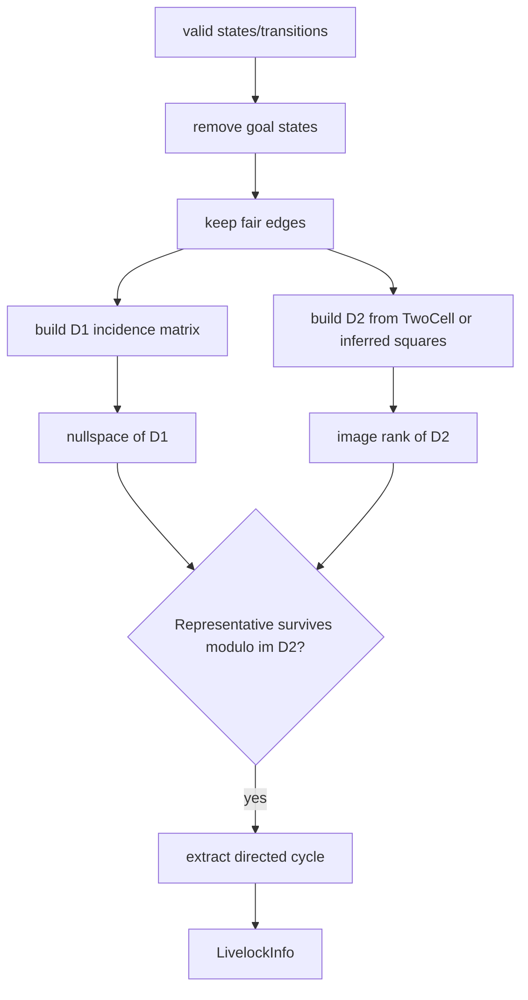

# Architecture

## Overview

現在のコードベースは小さく、公開 API と検証ロジックの大部分が `src/progress_based_verification/engine.py` に集約されています。

```text
src/progress_based_verification/
├── __init__.py   # 公開シンボルの re-export
└── engine.py     # データ型、入力検証、deadlock/livelock アルゴリズム
```

## Public objects



## Construction flow

`ProgressBasedVerificationEngine(...)` の初期化時には次の処理が行われます。



### Input normalization

`Transition` オブジェクトのほか、次の tuple も受け付けます。

```python
("s0", "s1")
("s0", "s1", "label")
("s0", "s1", "label", True)
```

内部ではすべて `Transition` に正規化されます。

### Input validation

主な invariant は次です。

- state が1件以上ある
- transition が1件以上ある
- goal / forbidden が既知 state を参照する
- 全 state coordinate の次元が一致する
- transition の source / target が既知 state
- すべての transition が各座標について単調非減少
- forbidden 除外後にも valid state が1件以上残る

## Deadlock path



SCC 内部では相互到達可能です。SCC を1ノードに圧縮すると DAG になり、出辺を持たない SCC が終端的な trap region です。

## Livelock path



## Where coordinates matter

進捗座標は2つの用途があります。

1. すべての transition が progress を逆行しないことの検証
2. `two_cells` が明示されない場合の unit-square 2-cell 推論

Deadlock の SCC 計算自体は座標値を使わず、valid state と transition のトポロジだけを使います。

## Fairness semantics

`fair_transition_predicate` が指定されていない場合は `Transition.fair` を参照します。

指定されている場合は predicate の戻り値が優先され、`Transition.fair` は直接は使われません。

```python
def is_fair(edge: Transition) -> bool:
    return edge.label.startswith("scheduler_")

engine = ProgressBasedVerificationEngine(
    states=states,
    transitions=transitions,
    fair_transition_predicate=is_fair,
)
```

ここでいう fairness は「公平性条件をモデルチェッカが証明する」という意味ではなく、livelock 解析に含める遷移をユーザーが選別するための入力です。
