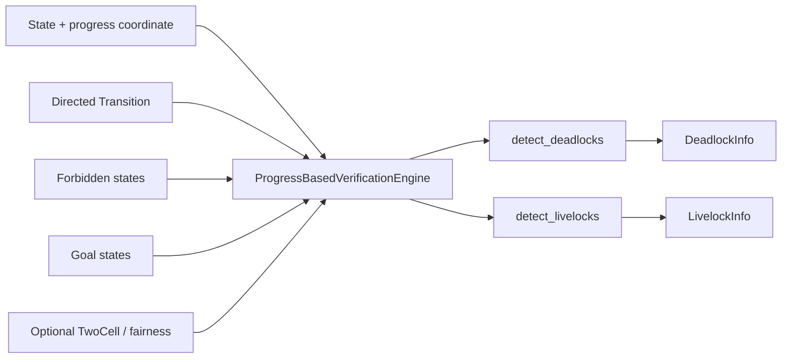

# Progress Based Verification

有限な並行システムを「進捗状態グラフ」としてモデル化し、**deadlock** と **livelock** を検出するための Python ライブラリです。

- Deadlock: 到達後に goal へ進めない終端的な trap region を SCC（強連結成分）から検出
- Livelock: fair な non-goal 部分複体に残る非自明な 1-cycle を、1次ホモロジー `H1 = ker(D1) / im(D2)` の近似計算で検出
- 状態には進捗座標を持たせ、すべての遷移は各座標について単調非減少であることを要求
- Python 3.10+ / NumPy

> このライブラリは有限状態モデルを対象とする検証エンジンです。ソースコードや実行中プロセスから状態遷移を自動抽出するツールではありません。

## まず見る場所

| 知りたいこと | ドキュメント |
|---|---|
| 何を入力し、何が返るか | [Modeling Guide](docs/modeling-guide.md) |
| 内部構成と処理フロー | [Architecture](docs/architecture.md) |
| Deadlock / Livelock の判定原理 | [Algorithms](docs/algorithms.md) |
| クラス・型・戻り値 | [API Reference](docs/api-reference.md) |
| 開発・テスト・ビルド | [Development Guide](docs/development.md) |
| 現時点の制約・注意点 | [Limitations](docs/limitations.md) |
| ドキュメント一覧 | [docs/README.md](docs/README.md) |

## Installation

開発中のリポジトリを直接利用する場合:

```bash
git clone https://github.com/kainanntou/progress_based_verification.git
cd progress_based_verification

python -m venv .venv
```

macOS / Linux:

```bash
source .venv/bin/activate
python -m pip install -U pip
python -m pip install -e ".[dev]"
```

Windows PowerShell:

```powershell
.\.venv\Scripts\Activate.ps1
python -m pip install -U pip
python -m pip install -e ".[dev]"
```

ランタイム依存は `numpy>=1.22`、開発依存には `pytest`, `ruff`, `mypy`, `hatch` が含まれます。

## 30-second example

```python
from progress_based_verification import (
    ProgressBasedVerificationEngine,
    Transition,
)

states = {
    "start": (0.0, 0.0),
    "p1_holds_a": (1.0, 0.0),
    "p2_holds_b": (0.0, 1.0),
    "deadlocked_wait": (1.0, 1.0),
    "goal": (2.0, 2.0),
}

transitions = (
    Transition("start", "p1_holds_a", "p1_lock_a"),
    Transition("start", "p2_holds_b", "p2_lock_b"),
    Transition("p1_holds_a", "deadlocked_wait", "p2_waits_a"),
    Transition("p2_holds_b", "deadlocked_wait", "p1_waits_b"),
)

engine = ProgressBasedVerificationEngine(
    states=states,
    transitions=transitions,
    goal_states={"goal"},
)

for item in engine.detect_deadlocks():
    print(item.state, item.trap_regions)
```

このモデルでは `deadlocked_wait` が、goal を含まない終端 trap region に入るため deadlock として報告されます。

## Core model

エンジンへの入力は、概ね次のグラフです。



### State

```python
states = {
    "s0": (0.0, 0.0),
    "s1": (1.0, 0.0),
}
```

キーは任意の hashable な ID、値は同一次元の float 座標です。

### Transition

```python
Transition(
    source="s0",
    target="s1",
    label="worker_1_progress",
    fair=True,
)
```

遷移は各座標について単調非減少でなければなりません。

```text
source = (x1, x2, ...)
target = (y1, y2, ...)

required: yi >= xi  for every axis i
```

### Goal / Forbidden

- `goal_states`: 正常完了・達成状態。livelock 解析では non-goal 空間から除外されます。
- `forbidden_states`: 無効・禁止領域。状態と、それに接続する遷移を有効空間から除外します。

### Fair transition

`Transition.fair=True` の遷移だけが標準の livelock 解析対象です。`fair_transition_predicate` を渡した場合は predicate の判定が優先されます。

## Deadlock detection

`detect_deadlocks()` は有効状態グラフを SCC に圧縮し、出辺を持たない bottom SCC を trap region として扱います。

ある状態から到達可能な bottom SCC の集合に goal が1つも含まれない場合、その状態を `DeadlockInfo` として報告します。そのため、bottom SCC 内の状態だけでなく、最終的にその trap にしか到達できない上流状態も報告対象になり得ます。

```python
deadlocks = engine.detect_deadlocks()

for deadlock in deadlocks:
    print(deadlock.state)
    print(deadlock.persistent_reachable)
    print(deadlock.trap_regions)
```

詳細: [docs/algorithms.md](docs/algorithms.md#deadlock-detection)

## Livelock detection

`detect_livelocks()` は fair かつ non-goal の部分グラフから境界行列 `D1`, `D2` を構成します。

```text
C2 --D2--> C1 --D1--> C0
```

そして、

```text
H1 = ker(D1) / im(D2)
```

に残る非自明な cycle を livelock 候補として返します。

```python
livelocks = engine.detect_livelocks()

for livelock in livelocks:
    print(livelock.homology_dimension)
    print(livelock.cycle_states)
    print([edge.label for edge in livelock.cycle_edges])
```

`D2` の 2-cell は明示的に `two_cells=` で与えることも、座標上の unit square から推論させることもできます。

詳細: [docs/algorithms.md](docs/algorithms.md#livelock-detection)

## Repository layout

```text
.
├── README.md
├── pyproject.toml
├── setup_and_build.ps1
├── setup_and_build.sh
├── docs/
│   ├── README.md
│   ├── architecture.md
│   ├── modeling-guide.md
│   ├── algorithms.md
│   ├── api-reference.md
│   ├── development.md
│   └── limitations.md
├── src/
│   └── progress_based_verification/
│       ├── __init__.py
│       └── engine.py
└── tests/
    └── test_verification.py
```

現時点では実装の大部分が `engine.py` に集約されています。

## Development

通常の開発チェック:

```bash
python -m pytest
python -m ruff format --check .
python -m ruff check .
python -m mypy --strict src tests
python -m hatch build
```

リポジトリ同梱の `setup_and_build.sh` / `setup_and_build.ps1` は、環境構築・lint・type check・test・build に加えて、最後に `git add -A` と commit まで実行する設計です。既存作業ツリーで実行する前に [Development Guide](docs/development.md) を確認してください。

## Current scope

この実装が現在提供しているのは、以下です。

- finite directed graph の入力検証
- forbidden state の除外
- Tarjan SCC による deadlock 判定
- fair non-goal subcomplex の構築
- `D1` / `D2` 境界行列の構築
- SVD / matrix rank を用いた非自明 1-cycle の検出
- 代表 cycle の抽出

一方、モデル抽出、CLI、ファイルフォーマット、可視化、状態空間探索、モデルチェッカとの連携などは現時点の実装範囲外です。詳細は [Limitations](docs/limitations.md) を参照してください。
